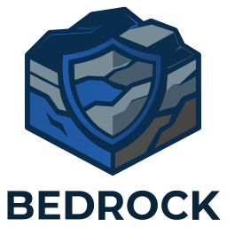

<p align="center">
  
</p>

# zcash-mining-infra

Zcash mining infrastructure monorepo: a Stratum V2 pool server, Job Declaration protocol for miner-controlled transaction selection, Noise Protocol encryption, compact block relay with forward error correction, and production observability.

This repository now reflects the merger of previously separate GitLab projects into a single workspace, including native FORGE relay support (`bedrock-forge`) and the standalone `forge-sidecar` binary.

Built for Zcash's Equihash (200,9) consensus -- 140-byte headers, 1,344-byte solutions, and 32-byte nonces.

## Architecture

The workspace includes the merged Stratum/JD infrastructure crates plus FORGE relay components in one repo (`crates/*`).

```
zcash-pool-server (main orchestrator)
|-- zcash-template-provider     Fetches templates from Zebra RPC
|-- zcash-mining-protocol       Binary message codec (NewEquihashJob, SubmitEquihashShare)
|-- zcash-equihash-validator    Share validation + adaptive difficulty (vardiff)
|-- zcash-pool-common           Shared types (PayoutTracker, CompactSize)
|-- zcash-jd-server             Job Declaration Server (miner-controlled templates)
|-- bedrock-noise               Noise_NK encryption (X25519 + ChaCha20-Poly1305)
|-- bedrock-strata              Prometheus metrics, structured logging, OpenTelemetry
`-- bedrock-forge               Compact block relay with Reed-Solomon FEC

zcash-jd-client (standalone binary)
|-- zcash-template-provider
|-- zcash-mining-protocol
`-- local Zebra node

forge-sidecar (standalone binary)
|-- bedrock-forge
`-- Zebra RPC polling
```

### Data flow

1. **TemplateProvider** polls Zebra's `getblocktemplate` RPC
2. **JobDistributor** creates `NewEquihashJob` messages from templates
3. Miners receive jobs, compute Equihash solutions, submit shares
4. **ShareProcessor** validates solutions via **EquihashValidator**
5. **VardiffController** adjusts per-miner difficulty targeting ~5 shares/min
6. **PayoutTracker** records PPS contributions
7. Found blocks are announced to **ForgeRelay** then submitted to Zebra

## Crates

| Crate | Description |
|-------|-------------|
| `zcash-pool-server` | Pool server: accepts miner connections, distributes jobs, validates shares, tracks payouts |
| `zcash-template-provider` | Fetches block templates from Zebra via JSON-RPC with longpoll caching |
| `zcash-mining-protocol` | Zcash Stratum V2 binary message types and codec with frame validation |
| `zcash-equihash-validator` | Equihash solution validation and adaptive difficulty controller |
| `zcash-pool-common` | Shared types: PPS payout tracker, CompactSize encoding |
| `zcash-jd-server` | Job Declaration Server for Coinbase-Only and Full-Template mining modes |
| `zcash-jd-client` | Job Declaration Client binary for decentralized template construction |
| `bedrock-noise` | Noise_NK encryption with X25519 key exchange and zeroized key material |
| `bedrock-strata` | Prometheus metrics, JSON logging, OpenTelemetry tracing |
| `bedrock-forge` | Low-latency compact block relay (BIP 152 adapted) with Reed-Solomon FEC |
| `forge-sidecar` | Sidecar binary for integrating FORGE relay into existing pools |

## Building

```bash
cargo build --release           # Build all crates
cargo build -p zcash-pool-server  # Build specific crate
cargo check                      # Fast type checking
cargo clippy                     # Lint checks
```

## Testing

```bash
cargo test                       # Run all tests
cargo test -p bedrock-forge      # Test specific crate
```

## Running

### Pool server

Requires a running [Zebra](https://github.com/ZcashFoundation/zebra) node with RPC enabled on port 8232.

```bash
cargo run --example run_pool -p zcash-pool-server
```

### Job Declaration Client

Allows miners to construct their own block templates for decentralized transaction selection.

```bash
cargo run -p zcash-jd-client -- \
    --zebra-url http://127.0.0.1:8232 \
    --pool-jd-addr 127.0.0.1:3334
```

### FORGE Sidecar

Bridges existing pools to the FORGE compact block relay network.

```bash
cp crates/forge-sidecar/config.example.toml config.toml
# Edit config.toml with your relay peers and auth key
cargo run -p forge-sidecar -- --config config.toml
```

### Examples

```bash
cargo run --example fetch_template -p zcash-template-provider  # Fetch template from Zebra
cargo run --example validate_share -p zcash-equihash-validator # Share validation demo
```

## Configuration

Pool server configuration (see `crates/zcash-pool-server/src/config.rs`):

| Setting | Default | Description |
|---------|---------|-------------|
| `listen_addr` | `0.0.0.0:3333` | TCP bind address for miner connections |
| `zebra_url` | `http://127.0.0.1:8232` | Zebra RPC endpoint |
| `nonce_1_len` | 4 | Pool nonce prefix length (bytes) |
| `initial_difficulty` | 1.0 | Starting share difficulty |
| `target_shares_per_minute` | 5.0 | Vardiff target rate |
| `noise_enabled` | false | Enable Noise_NK encryption |
| `jd_listen_addr` | None | Job Declaration port (e.g. `0.0.0.0:3334`) |
| `forge_relay_enabled` | false | Enable compact block relay |
| `metrics_addr` | None | Prometheus metrics endpoint |

## Job Declaration Modes

The JD protocol supports two modes for miner-controlled block construction:

- **Coinbase-Only**: Miner customizes the coinbase transaction output; pool provides the transaction list. Lower overhead, compatible with most setups.
- **Full-Template**: Miner selects all transactions in the block. Maximum decentralization and censorship resistance, requires the miner to run a Zebra node.

## Security

- **Noise_NK encryption** prevents StraTap, BiteCoin, and ISP Log attacks
- **Replay protection** via per-channel sequence validation
- **EROSION attack detection** through short-lived connection tracking
- **Timing attack mitigation** with configurable response jitter
- **Key material** zeroized on drop

See `docs/security/stratum-v2-attack-analysis.md` for the full threat model.

## Documentation

- `docs/stratum-v2-planning.md` -- Technical design and rationale
- `docs/plans/` -- Implementation phase plans
- `docs/integration/pool-operator-guide.md` -- Setting up a pool
- `docs/integration/miner-quickstart.md` -- Connect to a pool in 5 minutes
- `docs/integration/jd-client-guide.md` -- Running the JD Client
- `docs/integration/full-template-mode.md` -- Transaction selection guide
- `docs/integration/protocol-reference.md` -- Message format reference
- `docs/integration/migration-from-v1.md` -- Upgrading from Stratum V1

## External Dependencies

- **[Zebra](https://github.com/ZcashFoundation/zebra)** -- Zcash node providing `getblocktemplate` RPC (port 8232)
- **[equihash](https://crates.io/crates/equihash)** -- Core Equihash algorithm implementation

## License

MIT OR Apache-2.0
