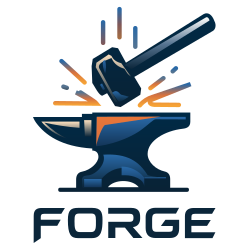

<p align="center">
  
</p>

# FORGE Sidecar

> Formerly `fiber-sidecar`.

A standalone sidecar binary that enables Stratum V1 mining pools to use bedrock-forge for low-latency block relay.

## Overview

The FORGE sidecar:
- Polls Zebra for new block templates
- Builds compact blocks when templates change
- Announces compact blocks to the FORGE relay network

This allows any V1 pool (NOMP, etc.) to benefit from compact block relay without modification.

## Usage

### Command Line

```bash
forge-sidecar \
    --zebra-url http://127.0.0.1:8232 \
    --relay-peer forge-relay.example.com:8333 \
    --auth-key 0123456789abcdef... \
    --poll-interval-ms 100
```

### Configuration File

```bash
forge-sidecar --config config.toml
```

See `config.example.toml` for all options.

## Architecture

```
STRATUM V1 POOL (unmodified)
        │
        ▼ getblocktemplate/submitblock
    ZEBRA NODE ◄──────────────────────┐
        │                             │
        │ poll templates              │ (future: submitblock)
        ▼                             │
   FORGE SIDECAR ─────────────────────┘
        │
        ▼ UDP/FEC
   FORGE RELAY NETWORK
```

## Requirements

- Zebra node with JSON-RPC enabled
- Network connectivity to FORGE relay nodes

## Building

```bash
cargo build --release -p forge-sidecar
```

Binary will be at `target/release/forge-sidecar`.
